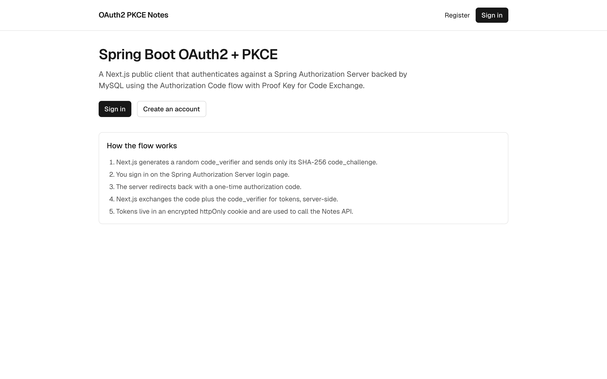
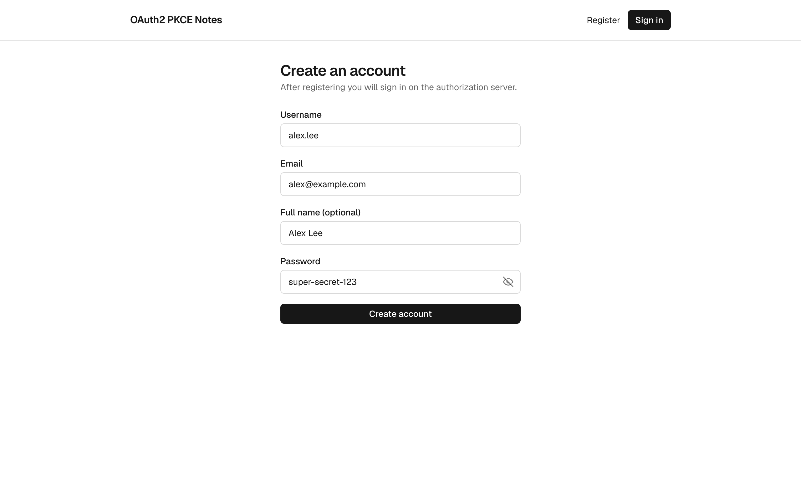
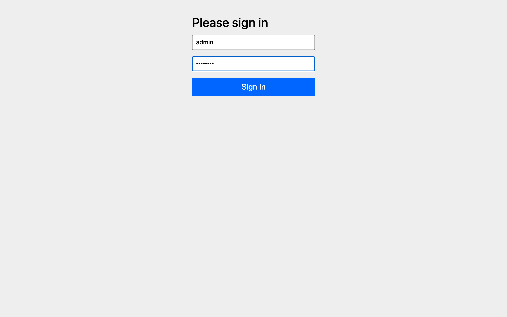
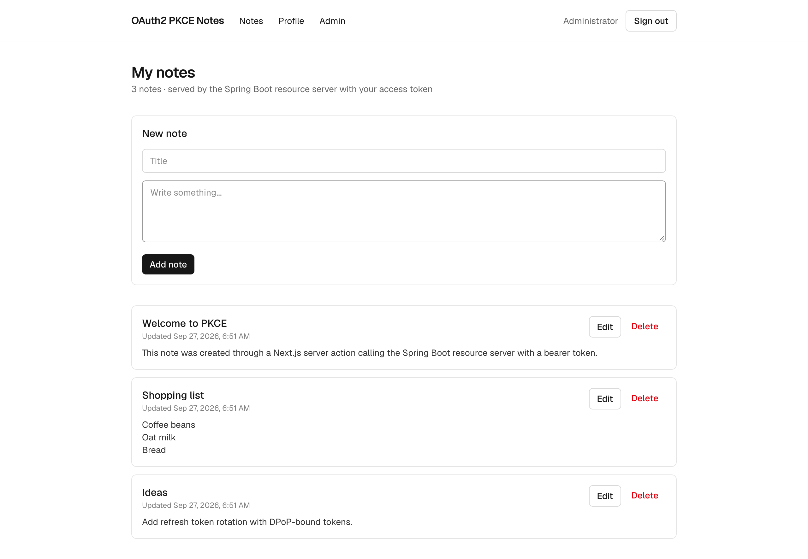
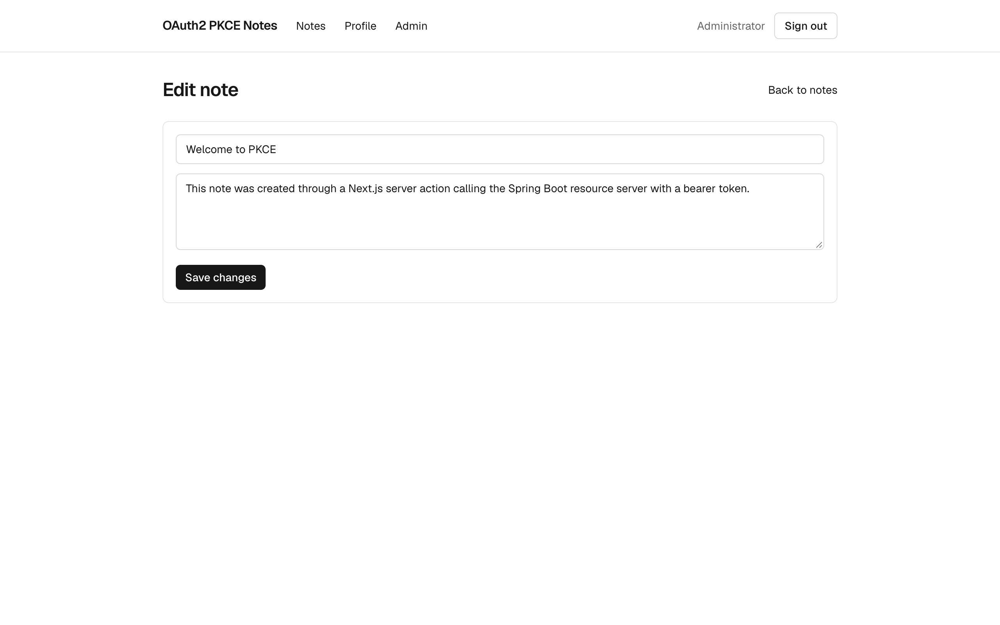
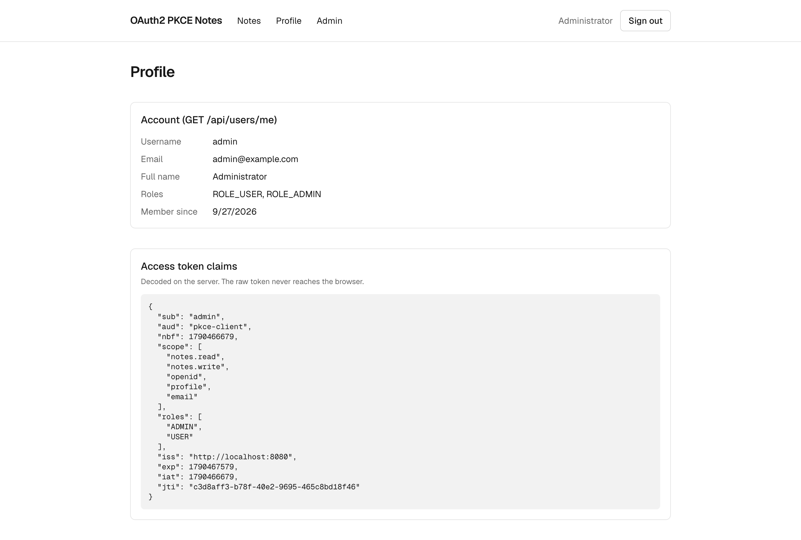
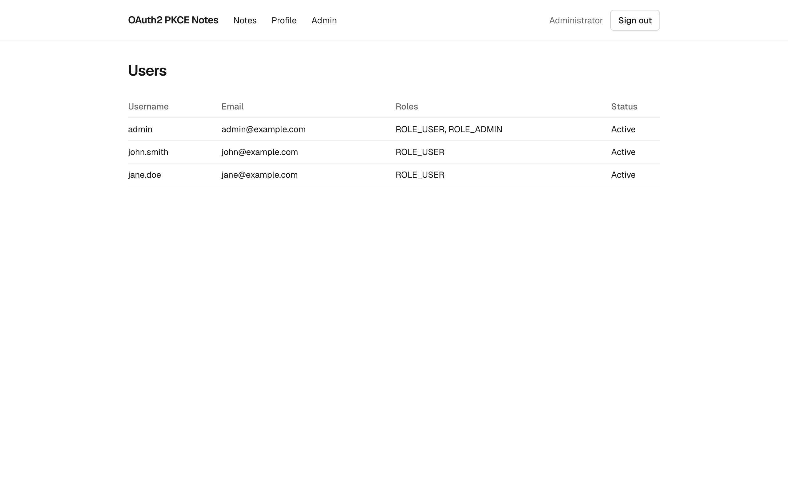

# spring-boot-oauth2-pkce-nextjs

OAuth2 **Authorization Code flow with PKCE** using a **Spring Boot 4** Authorization Server + Resource Server
backed by **MySQL**, and a **Next.js 16** frontend acting as the public client (Backend-for-Frontend).

## Tech stack

| Layer    | Tech                                                                                          |
|----------|-----------------------------------------------------------------------------------------------|
| Backend  | Java 25, Spring Boot 4.1, Spring Security 7 (Authorization Server + Resource Server), JPA     |
| Database | MySQL 8.4, Flyway migrations                                                                  |
| Frontend | Next.js 16 (App Router, Server Actions, Proxy), React 19, TypeScript, Tailwind CSS 4, jose, zod, Bun |
| Testing  | JUnit 5, MockMvc, Spring Security Test, Testcontainers (MySQL)                                |

## Screenshots

| Home | Register (show/hide password) |
|------|-------------------------------|
|  |  |

| Spring Authorization Server login | My notes |
|-----------------------------------|----------|
|  |  |

| Edit note | Profile & access token claims |
|-----------|-------------------------------|
|  |  |

| Admin (ROLE_ADMIN only) |
|-------------------------|
|  |

## Architecture

```
 Browser ──► Next.js (localhost:3000) ──────────────► Spring Boot (localhost:8080) ──► MySQL
            │ /api/auth/login    create verifier,         /oauth2/authorize  (login page)
            │                    redirect with S256       /oauth2/token      (verifies PKCE)
            │ /api/auth/callback exchange code+verifier   /oauth2/jwks, /userinfo, /connect/logout
            │ pages + server     call API with Bearer     /api/**            (JWT resource server)
            └ actions            token from encrypted cookie
```

1. `GET /api/auth/login` (Next.js) generates `code_verifier`, `state` and `nonce`, stores them in an encrypted
   httpOnly cookie and redirects to `/oauth2/authorize` with `code_challenge` (S256).
2. The user signs in on the Spring Authorization Server login page.
3. The server redirects to `/api/auth/callback?code=...&state=...`.
4. Next.js validates `state`, posts `code` + `code_verifier` to `/oauth2/token`, verifies the ID token
   (signature via JWKS, issuer, audience, nonce) and stores the tokens in an encrypted (A256GCM) session cookie.
5. Server components and server actions call `/api/**` with `Authorization: Bearer <access_token>`.

The client `pkce-client` is a **public client** (`client_authentication_method=none`) with
`requireProofKey=true`, so any authorization request without a `code_challenge` is rejected.

## Backend features

- Spring Authorization Server with **JDBC** stores (`oauth2_registered_client`, `oauth2_authorization`,
  `oauth2_authorization_consent`) on MySQL
- RSA signing keys persisted in MySQL (`oauth2_jwk`), so tokens survive restarts
- OIDC: discovery, UserInfo, RP-initiated logout; `roles` claim in access tokens, profile/email in ID tokens
- Users stored in MySQL (BCrypt passwords), default admin seeded on startup
- Scope-protected REST API with RFC 9457 Problem Details errors

## Getting started

### Prerequisites

- Java 25, Docker, [Bun](https://bun.sh) ≥ 1.3

### 1. Run the backend

```bash
./mvnw spring-boot:run
```

`spring-boot-docker-compose` starts MySQL from [`compose.yaml`](compose.yaml) automatically
(host port **3308**). Flyway creates the schema, then the app registers the `pkce-client` and seeds the admin user.

To use your own MySQL instead, set `DB_URL`, `DB_USERNAME` and `DB_PASSWORD`, and remove
`spring-boot-docker-compose` or set `spring.docker.compose.enabled=false`. Keep these JDBC URL parameters:
`preserveInstants=true&connectionTimeZone=UTC&forceConnectionTimeZoneToSession=true`.

### 2. Run the frontend

```bash
cd frontend
cp .env.example .env.local   # then set SESSION_SECRET (openssl rand -base64 32)
bun install
bun dev
```

Open http://localhost:3000 and sign in with **admin / admin123**, or register a new account.

## Default configuration

| Property                                   | Default                                  |
|--------------------------------------------|------------------------------------------|
| Issuer                                     | `http://localhost:8080`                  |
| Client ID                                  | `pkce-client` (public, PKCE required)    |
| Redirect URIs                              | `http://localhost:3000/api/auth/callback`, `http://127.0.0.1:8080/authorized` |
| Scopes                                     | `openid profile email notes.read notes.write` |
| Access token TTL                           | 15 minutes                               |
| Admin user                                 | `admin` / `admin123`                     |

All values can be overridden with environment variables. See [`application.yaml`](src/main/resources/application.yaml).

## API

| Method | Endpoint                 | Auth                  | Description                   |
|--------|--------------------------|-----------------------|-------------------------------|
| GET    | `/api/public/info`       | none                  | Client / issuer information   |
| POST   | `/api/users/register`    | none                  | Register a new user           |
| GET    | `/api/users/me`          | Bearer                | Current user profile          |
| GET    | `/api/notes`             | `SCOPE_notes.read`    | List own notes (paginated)    |
| GET    | `/api/notes/{id}`        | `SCOPE_notes.read`    | Get own note                  |
| POST   | `/api/notes`             | `SCOPE_notes.write`   | Create note                   |
| PUT    | `/api/notes/{id}`        | `SCOPE_notes.write`   | Update own note               |
| DELETE | `/api/notes/{id}`        | `SCOPE_notes.write`   | Delete own note               |
| GET    | `/api/admin/users`       | `ROLE_ADMIN`          | List all users                |

OAuth2 / OIDC endpoints: `/.well-known/openid-configuration`, `/oauth2/authorize`, `/oauth2/token`,
`/oauth2/jwks`, `/oauth2/revoke`, `/oauth2/introspect`, `/userinfo`, `/connect/logout`.

### Manual PKCE flow with curl

```bash
VERIFIER=$(openssl rand -base64 48 | tr -d '=+/\n' | cut -c1-64)
CHALLENGE=$(printf %s "$VERIFIER" | openssl dgst -sha256 -binary | openssl base64 | tr '+/' '-_' | tr -d '=\n')

# 1. Open in a browser, sign in, copy the "code" from the redirect URL
echo "http://localhost:8080/oauth2/authorize?response_type=code&client_id=pkce-client&scope=openid%20profile%20notes.read%20notes.write&redirect_uri=http://127.0.0.1:8080/authorized&code_challenge=$CHALLENGE&code_challenge_method=S256"

# 2. Exchange the code (no client secret, just the verifier)
curl -X POST http://localhost:8080/oauth2/token \
  -d grant_type=authorization_code -d client_id=pkce-client \
  -d redirect_uri=http://127.0.0.1:8080/authorized \
  -d code=<CODE> -d code_verifier=$VERIFIER

# 3. Call the API
curl http://localhost:8080/api/notes -H "Authorization: Bearer <ACCESS_TOKEN>"
```

## Tests

```bash
./mvnw test
```

Integration tests start MySQL with Testcontainers (Docker required). They cover the full PKCE flow, including
rejection of a missing `code_challenge`, a wrong `code_verifier` and authorization code reuse, as well as
scope- and role-based authorization.

## Project structure

```
src/main/java/id/my/jvm/oauth2_pkce
├── common/     exception handling (Problem Details)
├── config/     typed app properties, password encoder
├── note/       notes entity, repository, service, controller
├── security/   authorization server, resource server, JWK store, client registration, token customizer
├── user/       user entity, UserDetailsService, registration, admin seeder
└── web/        public endpoints
src/main/resources/db/migration   Flyway scripts (Vx_DDMMYYYY_HHMM__description.sql)
frontend/                         Next.js 16 client (see frontend/README.md)
```
